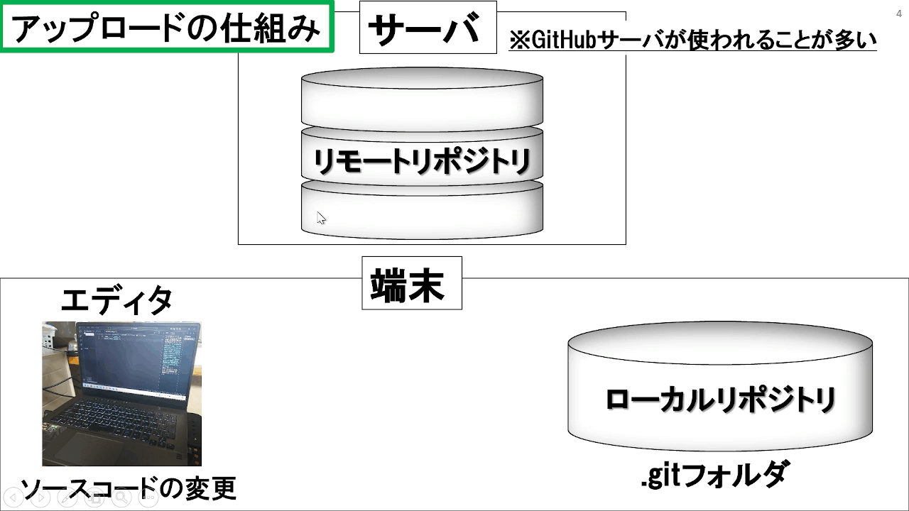
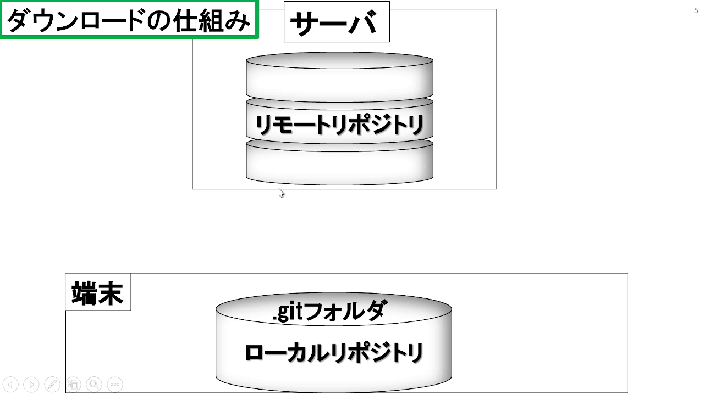

# GitHub
## 用語
| 用語          | 説明 |
| -             | - |
| **Git**       | 分散型バージョン管理システム |
| **GitHub**    | Git を利用したWebアプリケーション|
## gitコマンドの使い方

<a href ="https://gitforwindows.org/"> 
    
</a>

[**Install**](https://gitforwindows.org/)

### 設定
#### ユーザ登録
```
git config --global user.name <名前>
git config --global user.email <メールアドレス>
```
##### 確認
* Windows 
```
git config --list | findstr "user.name"
git config --list | findstr "user.email"
```
* Linux
```
git config --list | grep "user.name"
git config --list | grep "user.email"
```
#### Alias設定
```
git config --global alias.<新たに設定したいコマンド名> <gitコマンド>
```
→ ```git <新たに設定したいコマンド名>```を打つと```git <gitコマンド>```が実行される
#### ローカルリポジトリの状態を確認する
```
git status
```
#### ログの確認
```
git log
git log - <確認したいログの数>
```

### リポジトリ操作
#### リポジトリの設定
##### ローカルリポジトリの作成
```
git init
```
- .gitという隠しフォルダが生成される(このディレクトリ内での作業が可能になる)
##### リモートリポジトリの指定  
```
git remote add origin <リポジトリのURL>
```
##### メインブランチを指定  
```
git branch -M main
```
#### アップロード



##### アップロードするファイルを指定
```
git add <ファイル名, ディレクトリ名, -A:全て>
```
##### ローカルリポジトリにコミット
```
git commit -m "コメント"
```
##### リモートリポジトリにプッシュ
```
git push -u origin main  // 初回のみ (競合解決)
git push
git push -f //強制push
```
- `-u` : --set-upstream
- ローカルブランチの上流が <ブランチ名> へ移る

#### ダウンロード



##### clone
- リモートリポジトリ上の全てのファイルがダウンロードされる
```
git clone <リポジトリのURL>
```
##### pull
- 更新されているリモートリポジトリのファイルを
ローカルリポジトリにダウンロード
```
git pull origin <ブランチ名> // 初回のみ
git pull
```
#### ファイル復元
```
git restore <ファイル名, ディレクトリ名>
```
#### ステージングエリアに保管されているファイルの取り消し
```
git restore --staged <取り消したいファイル・フォルダ名>
```
#### プッシュを取り消す
```
git reset --hard <取り消すプッシュの直前のコミットハッシュ値> 
```
`<取り消すプッシュの直前のコミットハッシュ値> ` : `git log`で確認

### ブランチ操作
#### ブランチ確認
```
git branch -a
```
#### ブランチ作成・移動
```
git switch -c <新しいブランチ名, 移動先ブランチ名>
```
#### ブランチの移動
```
git switch <切り替え先のブランチ名>
```
#### ブランチ合成
```
git merge <併合したいブランチ>
git merge --allow-unrelated-histories //履歴の異なるブランチを合成することを許可する
```
→ 自ブランチに<併合したいブランチ>が合成される

#### ブランチ名変更
```
git branch -m <元のブランチ名> <変更したブランチ名>
```

### ブランチのマージ
1. 併合先のブランチへ移動
```
git switch <併合先ブランチ>
```
2. ブランチを併合
```
git merge --allow-unrelated-histories <併合元のブランチ>
```

3. 混乱しないように、併合元のブランチを削除(推奨)

#### ローカルブランチ削除
```
git branch -d <削除したいブランチ> // 変更をマージした後実行可能
git branch -D　<過去の変更まで完全削除したいブランチ>
```
#### リモートリポジトリのブランチを削除
```
git push origin --delete <削除したいブランチ名>
```

#### マージの取り消し
```
git merge --abort
```

### Gitの更新
* Windows 
```
git update-git-for-windows
```

## Reference
> - [Git インストール方法](https://qiita.com/T-H9703EnAc/items/4fbe6593d42f9a844b1c)  
> - [GitHub アカウント作成方法](https://qiita.com/ayatokura/items/9eabb7ae20752e6dc79d)